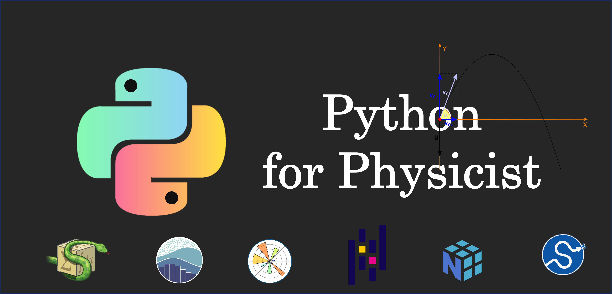

<div align="center">
  <h1> Python for Physicist - Course Outline</h1>
</div>



Welcome to the **Python for Physicist** repository! This repository is designed to teach Python programming from basics to advanced levels, specifically tailored for Physics students. The content focuses on Python’s practical applications in solving physics problems, data analysis, and scientific computing.

## Table of Contents

1. [Introduction](#introduction)
2. [Getting Started](#getting-started)
3. [Course Outline](#course-outline)
    - [Introduction to Python](#1-introduction-to-python)
    - [Advanced Data Types and Operations](#2-advanced-data-types-and-operations)
    - [NumPy for Numerical Computing](#3-numpy-for-numerical-computing)
    - [Matplotlib for Data Visualization](#4-matplotlib-for-data-visualization)
    - [Pandas for Data Analysis](#5-pandas-for-data-analysis)
    - [SymPy for Symbolic Computation](#6-sympy-for-symbolic-computation)
    - [SciPy for Scientific Computing](#7-scipy-for-scientific-computing)
    - [Object-Oriented Programming](#8-object-oriented-programming)
    - [Error Handling and Debugging](#9-error-handling-and-debugging)
    - [Parallel Computing](#10-parallel-computing)
    - [Machine Learning Basics (Optional)](#11-machine-learning-basics-optional)
    - [Final Projects](#12-final-projects)
4. [Resources](#resources)

---

## Introduction

This repository is aimed at Physics students who want to learn Python programming and apply it to solve physics-related problems. Whether you are new to programming or have some prior experience, this course will help you build a solid foundation and advance to more specialized topics like scientific computing, data analysis, and simulations in physics.

---

## Getting Started

To get started with this course, follow these steps:

1. **Install Python**: Download and install the latest version of Python from [python.org](https://www.python.org/downloads/).
2. **Set up an IDE**: We recommend using:
   - [VS Code](https://code.visualstudio.com/)
   - [Jupyter Notebook](https://jupyter.org/)
3. **Clone the repository**:
   ```bash
   git clone https://github.com/scnilkunwar/Python-for-Physicist.git


# Course Outline

This course is structured into multiple modules, progressing from Python basics to advanced topics. Each module includes theory, coding exercises, and physics-related problem-solving.

---

### 1. **Introduction to Python**
   - Basic Python syntax, data types, control structures, and functions.
   - **Example Exercises**:
     - Write a program to calculate the velocity of an object.
     - Simulate basic kinematic equations using user inputs.

---

### 2. **Advanced Data Types and Operations**
   - Lists, dictionaries, string manipulations, and file I/O.
   - **Example Exercises**:
     - Create a CSV reader that processes physics data.
     - Manipulate strings to extract numerical data from physics reports.

---

### 3. **NumPy for Numerical Computing**
   - Creating and manipulating arrays, performing linear algebra operations.
   - **Example Exercises**:
     - Solve systems of linear equations using NumPy arrays.
     - Perform matrix operations for physical systems like vector fields.

---

### 4. **Matplotlib for Data Visualization**
   - Plotting experimental data and visualizing physics concepts.
   - **Example Exercises**:
     - Plot frequency vs. stopping potential data from a photoelectric experiment.
     - Visualize oscillatory motion using sine and cosine functions.

---

### 5. **Pandas for Data Analysis**
   - Working with DataFrames for efficient data handling.
   - **Example Exercises**:
     - Analyze large datasets from physics experiments.
     - Compute statistical properties (mean, variance) of experimental data.

---

### 6. **SymPy for Symbolic Computation**
   - Algebraic manipulation, solving symbolic equations, and calculus.
   - **Example Exercises**:
     - Solve differential equations like Schrodinger's equation.
     - Perform symbolic integration and differentiation in classical mechanics.

---

### 7. **SciPy for Scientific Computing**
   - Advanced tools for integration, differential equations, and optimization.
   - **Example Exercises**:
     - Solve systems of differential equations related to physical phenomena.
     - Use optimization methods to minimize functions in physics problems.

---

### 8. **Object-Oriented Programming**
   - Modeling physical systems using object-oriented principles.
   - **Example Exercises**:
     - Create a class for a particle and simulate its motion under different forces.
     - Implement a simple physics engine for collision detection.

---

### 9. **Error Handling and Debugging**
   - Techniques for debugging and handling errors in physics simulations.
   - **Example Exercises**:
     - Identify and fix bugs in a simulation of planetary motion.
     - Simulate error scenarios in experimental calculations.

---

### 10. **Parallel Computing**
   - Performing parallel computations to speed up simulations and analyses.
   - **Example Exercises**:
     - Simulate a Monte Carlo method with parallel processing for efficiency.
     - Run multiple experiments in parallel to analyze quantum systems.

---

### 11. **Machine Learning Basics (Optional)**
   - Brief introduction to machine learning and its applications in physics.
   - **Example Exercises**:
     - Build a simple linear regression model to predict physical properties.
     - Use machine learning to classify materials based on physical data.

---

### 12. **Final Projects**
   - Apply everything you've learned to a real-world physics problem.
   - **Project Ideas**:
     - Simulate the motion of planets in a solar system.
     - Analyze data from a physics lab experiment and visualize the results.
     - Build a small machine learning model to predict material properties.
# Resources

Here are some useful resources to help you throughout this course:

### Python Programming

- [Official Python Documentation](https://docs.python.org/3/)
- [Python Package Index (PyPI)](https://pypi.org/)

### Scientific Libraries

- [NumPy Documentation](https://numpy.org/doc/)
- [SciPy Documentation](https://scipy.org/doc/)
- [Matplotlib Documentation](https://matplotlib.org/stable/contents.html)
- [SymPy Documentation](https://docs.sympy.org/latest/index.html)
- [Pandas Documentation](https://pandas.pydata.org/pandas-docs/stable/)

### General Python and Physics Learning

- [Python for Data Science Handbook](https://jakevdp.github.io/PythonDataScienceHandbook/)
- [Project Jupyter](https://jupyter.org/)
- [MIT OpenCourseWare – Computational Physics](https://ocw.mit.edu/courses/physics/)
- [Kaggle](https://www.kaggle.com/) (for practicing data analysis with real-world datasets)

Feel free to explore these links as you work through the course!
